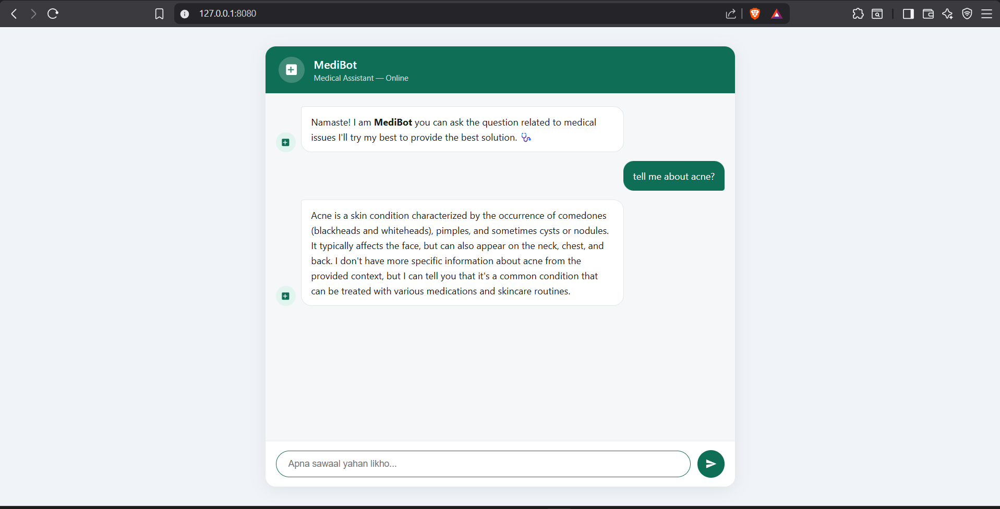

# 🏥 Medical Chatbot — RAG-based AI Assistant

A production-ready medical chatbot built using **LangChain**, **Pinecone**, **Groq (LLaMA 3.3)**, and **Flask**. It uses Retrieval-Augmented Generation (RAG) to answer medical questions from a custom PDF knowledge base.



---

## 🚀 Tech Stack

| Technology | Purpose |
|---|---|
| Python 3.10 | Core language |
| LangChain | LLM orchestration & RAG pipeline |
| Pinecone | Vector database for embeddings |
| Groq (LLaMA 3.3-70b) | LLM for answer generation |
| HuggingFace Embeddings | Text embeddings (all-MiniLM-L6-v2) |
| Flask | Web framework |
| AWS EC2 + ECR | Cloud deployment |
| Docker | Containerization |
| GitHub Actions | CI/CD pipeline |

---

## 📁 Project Structure

```
Medical_Chatbot/
├── data/                  # PDF knowledge base
├── src/
│   ├── helper.py          # PDF loading, chunking, embeddings
│   └── prompt.py          # System prompt for LLM
├── static/                # CSS, JS assets
├── templates/             # HTML templates
├── app.py                 # Flask app
├── store.index.py         # Pinecone vector store indexing
├── requirements.txt
└── .env                   # API keys (not committed)
```

---

## ⚙️ Local Setup

### Step 1 — Clone the repository

```bash
git clone https://github.com/Codeabhi096/Medical_Chatbot.git
cd Medical_Chatbot
```

### Step 2 — Create and activate virtual environment

```bash
python -m venv venv

# Windows
venv\Scripts\activate

# macOS/Linux
source venv/bin/activate
```

### Step 3 — Install dependencies

```bash
pip install -r requirements.txt
```

### Step 4 — Set up environment variables

Create a `.env` file in the root directory:

```ini
PINECONE_API_KEY=your_pinecone_api_key_here
GROQ_API_KEY=your_groq_api_key_here
```

> Get your Pinecone key at [pinecone.io](https://www.pinecone.io) and Groq key at [console.groq.com](https://console.groq.com)

### Step 5 — Index your PDF into Pinecone

```bash
python store.index.py
```

### Step 6 — Run the app

```bash
python app.py
```

Open your browser and go to: **http://localhost:8080**

---

## ☁️ AWS Deployment with GitHub Actions (CI/CD)

### 1. Create IAM User

In AWS Console, create an IAM user with these policies:
- `AmazonEC2ContainerRegistryFullAccess`
- `AmazonEC2FullAccess`

### 2. Create ECR Repository

Create a new ECR repo to store your Docker image.

### 3. Launch EC2 Instance (Ubuntu)

Launch an EC2 Ubuntu instance and install Docker:

```bash
sudo apt-get update -y
sudo apt-get upgrade -y
curl -fsSL https://get.docker.com -o get-docker.sh
sudo sh get-docker.sh
sudo usermod -aG docker ubuntu
newgrp docker
```

### 4. Configure EC2 as GitHub Self-Hosted Runner

Go to your GitHub repo:
`Settings → Actions → Runners → New self-hosted runner`

Choose your OS and run the commands one by one on your EC2 instance.

### 5. Add GitHub Secrets

Go to `Settings → Secrets and variables → Actions` and add:

| Secret | Description |
|---|---|
| `AWS_ACCESS_KEY_ID` | IAM user access key |
| `AWS_SECRET_ACCESS_KEY` | IAM user secret key |
| `AWS_DEFAULT_REGION` | e.g. `us-east-1` |
| `ECR_REPO` | Your ECR repository URI |
| `PINECONE_API_KEY` | Pinecone API key |
| `GROQ_API_KEY` | Groq API key |

Once secrets are set, every push to `main` will automatically build, push to ECR, and deploy on EC2.

---

## 📄 License

This project is licensed under the [MIT License](LICENSE).